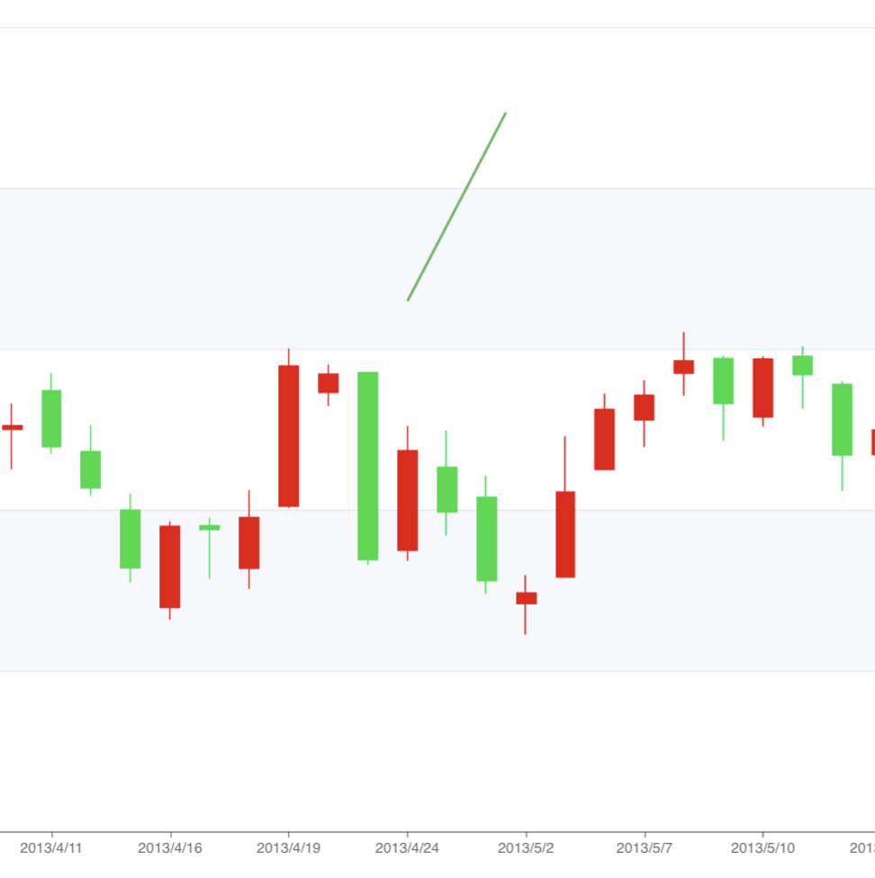
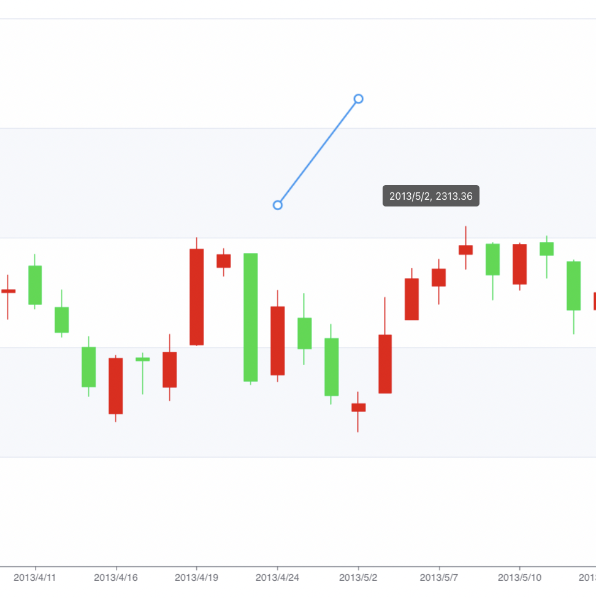
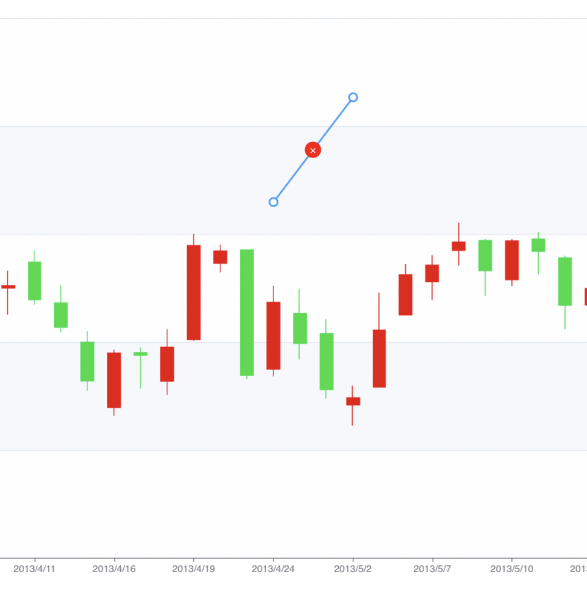
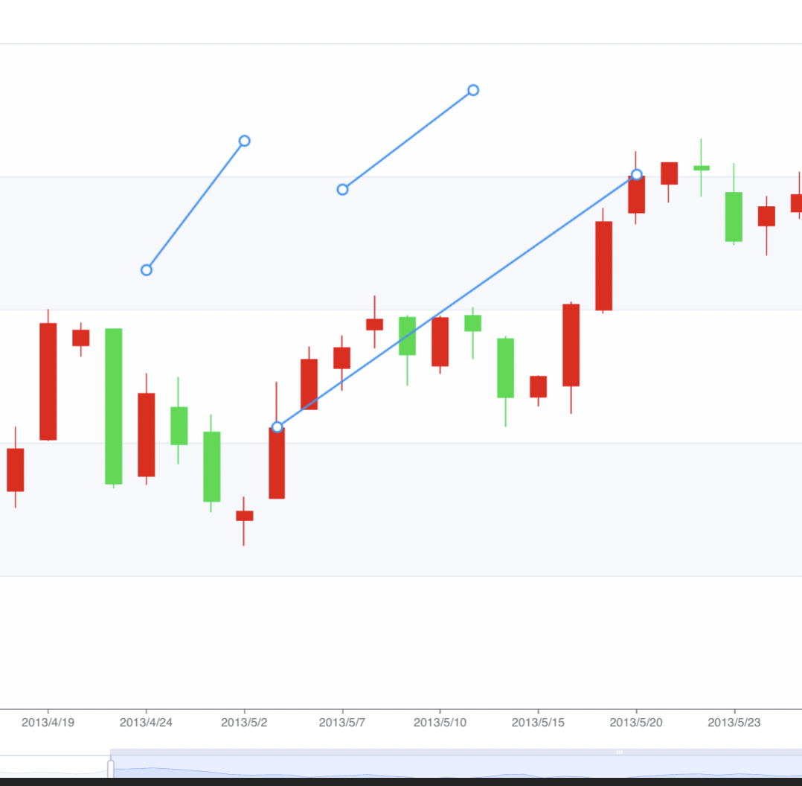

# Tusta Assignment

## How have I implemented this?

- **Candlestick Chart** powered by [Apache ECharts](https://echarts.apache.org/)  
- **Canvas Overlay** on top of the chart for drawing, dragging, and resizing trendlines  
- **Interactive**:  
  - Click & drag (left mouse) on blank space to draw a new trendline  
  - Hover over endpoints to see “date, price” tooltips  
  - Hover over a line segment to reveal a delete button in the middle  
  - Click on an endpoint or line body to resize/drag a saved line  
- **Persistence**: Drawn lines are saved in `localStorage`, so they survive a page reload  
- **Responsive**: If you resize or zoom the chart, lines are always re-rendered in the correct data space

---

Project Deployed here:
https://tusta-assignment.vercel.app/

Screenshots

> 📸 If you’re curious how it looks, here’s a quick demo:

1. **Drawing a new line**  
   

2. **Hovering over an endpoint**  
   

3. **Delete Icon on Hover**  
   

4. **Multiple Trendlines**
   

---

## Getting Started

These instructions assume you have Node.js (≥12.x) and npm (or Yarn) installed on your machine.

1. Clone this repository:  
   
   git clone https://github.com/pathak16/tusta-assignment.git

3. Installing dependencies:

   Using npm:
   npm install

   Or if you prefer Yarn:
   yarn install

   Install Apache ECharts:
   npm install echarts

4. Start the development server
   npm run dev

5. Build for production
   npm run build

How it works:

###1. ECharts Initialization

   We initialize a simple candlestick chart inside a React useEffect.
   The x-axis is a category of dates (from dummy data), and the y-axis is the price range.

2. Canvas Overlay

  A <canvas> element sits on top of the chart (absolute positioning, full width/height).
  Canvas has pointer-events: auto, so it catches all mouse events (and we call e.preventDefault() to stop the chart’s native pan/zoom).

3. Drawing & Previewing a New Line

  On mousedown (left-click) in a blank area, we defer isDrawingNewLine = true via setTimeout(..., 0) so the first mousemove sees it.
  While dragging, we clear the canvas and draw a green preview line from the initial click to the current mouse position.

4. Saving a New Line

  On mouseup, we convert both endpoints from pixel-space to data-space (chart.convertFromPixel) and push a new trendline object into trendlinesRef.current.
  That line object looks like { id: Date.now(), start: { xData, yData }, end: { xData, yData } }.
  We then serialize trendlinesRef.current into localStorage so it persists.

5. Rendering All Saved Lines

  Whenever the chart resizes or zooms (on dataZoom, rendered, resize), we call drawAllLines().
  That method loops through trendlinesRef.current, converts each start/end from data→pixel (chart.convertToPixel), draws the line, and        renders small circular “handles” at each endpoint.

6. Dragging / Resizing Existing Lines

  On mousedown, we loop through each saved line:
  
  Convert endpoints to pixels → check if the click is within 8px of either handle → if so, set draggingLineRef.current = { line, mode: "start" or "end" }.
  
  Otherwise, check if the click is “near” the line body (within 6px). If yes, record offsets from the click to each endpoint → set mode: "move".
  
  On mousemove (while a draggingLineRef.current is set):
  If mode === "start" or "end", we convert the current mouse pixel to data, then overwrite line.start or line.end with the new data coords.
  If mode === "move", we recalculate both endpoints by subtracting the stored offsets, convert them back to data via convertFromPixel, and overwrite both.
  
  After any change, we call drawAllLines().

7. Hover & Delete Icon

On every mousemove when not dragging/drawing, we check each line’s endpoints (pixel-space) for proximity < 8px. If one matches, we show a tooltip with date & price.
If not hovering an endpoint, we check if the mouse is “near” any line body (pixel-space). If so, we set a React state hoveredLine = { id, x: midX, y: midY }. That state renders a small red “×” button at that midpoint.
Clicking that “×” deletes the line from trendlinesRef.current and updates localStorage.

Project Structure

tusta-assign/
├── public/
│   ├── index.html
│   └── …
├── src/
│   ├── components/
│   │   └── CandlestickWithTrendline.jsx    # Main component (chart + overlay)
│   ├── data/
│   │   └── rawData.js                      # Dummy candlestick data
│   ├── App.js
│   ├── index.js
│   └── styles.css                          # Optional minimal styling
├── .gitignore
├── package.json
└── README.md

src/components/CandlestickWithTrendline.jsx
Contains the React component that initializes ECharts, sets up the <canvas> overlay, and implements all drawing/dragging logic.

src/data/rawData.js
Example dummy data in [[date, open, high, low, close], …] format. You can replace this file or swap in a real API call if you like (e.g. Binance).

public/index.html
Standard CRA boilerplate—just renders the #root div.

 

